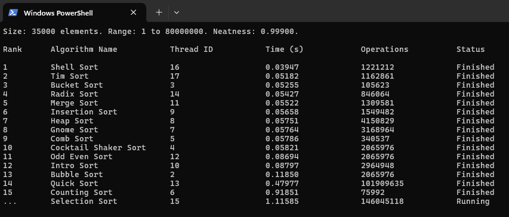

# Sorting Algorithm Race
A terminal-based sorting algorithm race visualizer, which puts 16 different sorting algorithms head to head to showcase how different array ranges and sizes effect the performance of various types of sorting algorithms.

## About
This project puts 16 different sorting algorithms in a race. Each algorithm has one thread to run on, as the main thread prints the information to the terminal. The program keep tracks of general statistics as well as the number of operations - those being mainly comparisons and writes to arrays. It is worth mentioning the operations section is a little broad and inconsistent across all 16 algorithms, but still an important feature to have nonetheless.

There are 5 total statuses a sorting algorithm can be in: "Ready", "Running", "Checking", and then either "Finished" or "Failed". Since the "Checking" state is just seeing if everything is sorted, the status quickly changes to "Finished", making it hard to notice it is there. However, with a high enough element count, you will notice it for a brief second.

The program waits for the user to press Enter, than sorts the vector `dataset`. Each algorithm makes a copy of the same data by passing it into the array for each function to ensure fairness among our racers. Once the algorithm is finished, it is passed to the function `verify`, and if that function returns `true` the status is set to "Finished", or if `verify` returns `false`, "Failed".

The program also shows each thread's ID, the time in seconds, and of course the rank of the sorting algorithm upon completion. It is worth noting the time taken is likely not accurate for each sorting algorithm, if we are only talking about the raw speed to sort the array. In the code for the sorting algorithm it increases `sort.operations` for the sort's respective class, which does take time.

Below is a table with some basic information on each sorting algorithm, per ChatGPT:

| Algorithm | Average Time | Best Time | Worst Time | Space | Type |
|-----------|--------------|-----------|------------|-------|------|
| Bubble Sort | $O(n^2)$ | $O(n)$ | $O(n^2)$ | $O(1)$ | Exchange |
| Bucket Sort | $O(n + k)$ | $O(n + k)$ | $O(n^2)$ | $O(n + k)$ | Distribution (Non-comparison) |
| Cocktail Shaker Sort | $O(n^2)$ | $O(n)$ | $O(n^2)$ | $O(1)$ | Exchange |
| Comb Sort | $O(n^2)$ | $O(n \log n)$ | $O(n^2)$ | $O(1)$ | Exchange |
| Counting Sort | $O(n + k)$ | $O(n + k)$ | $O(n + k)$ | $O(n + k)$ | Distribution (Non-comparison) |
| Gnome Sort | $O(n^2)$ | $O(n)$ | $O(n^2)$ | $O(1)$ | Exchange |
| Heap Sort | $O(n \log n)$ | $O(n \log n)$ | $O(n \log n)$ | $O(1)$ | Selection (Heap-based) |
| Insertion Sort | $O(n^2)$ | $O(n)$ | $O(n^2)$ | $O(1)$ | Insertion |
| Introsort | $O(n \log n)$ | $O(n \log n)$ | $O(n \log n)$ | $O(\log n)$ | Hybrid (Quick + Heap + Insertion) |
| Merge Sort | $O(n \log n)$ | $O(n \log n)$ | $O(n \log n)$ | $O(n)$ | Merge (Divide & Conquer) |
| Odd-Even Sort | $O(n^2)$ | $O(n)$ | $O(n^2)$ | $O(1)$ | Exchange |
| Quicksort | $O(n \log n)$ | $O(n \log n)$ | $O(n^2)$ | $O(\log n)$ | Partition Exchange (Divide & Conquer) |
| Radix Sort | $O(d(n + k))$ | $O(d(n + k))$ | $O(d(n + k))$ | $O(n + k)$ | Distribution (Non-comparison) |
| Selection Sort | $O(n^2)$ | $O(n^2)$ | $O(n^2)$ | $O(1)$ | Selection |
| Shell Sort | $O(n^{3/2})$ | $O(n \log n)$ | $O(n^2)$ | $O(1)$ | Insertion (Gap-based) |
| Tim Sort | $O(n \log n)$ | $O(n)$ | $O(n \log n)$ | $O(n)$ | Hybrid (Merge + Insertion) |

## Inspiration
I orignally was motivated to make this from a video on YouTube. I thought it was interesting how many sorting algorithms existed I had no idea about, and the fact that they actually all had a unique process to sort data was fascinating.

<a href="https://www.youtube.com/watch?v=vr5dCRHAgb0">
  
</a>

[sorting algorithms to relax/study to](https://www.youtube.com/watch?v=vr5dCRHAgb0)

However, I thought it was lacking the ability to race. I also wanted to see how different sorts handle different ranges and amounts of data. Would one sort always rank first? How much effect does varying these aspects of the data actually cause?

Later on, I uncovered more resources similar to the video: [Toptal Sorting Algorithms](https://www.toptal.com/developers/sorting-algorithms) and [Sound of Sorting](https://github.com/bingmann/sound-of-sorting).

## Observations
Through running my program, a few things stood out to me:
- Intro sort, which has a lot of logic in deciding which sort to use, placed lower on very small datasets since more simpler ones got straight to the point and avoided more complex optimizations.
- Non-caomparitve sorts such as Radix Sort, Bucket Sort, and Counting Sort remained dominant over large datasets, which makes sense due to their linear time.
- With smaller datasets, the top ranked algorithms are almost impossible to predict. This is because at this number of elements, the randomness more greatly effects how each algorithm sorts. You need a larger dataset for the sorting algorithms to differentiate themselves from each other, sort of similar to the idea in the law of large numbers.
- With a higher neatness, the slower algorithms benefit the most, except Selection sort, because it still goes through roughly the same amount of checks when finding the next element to select.

## Dependencies
- C++
- CMake

## Build and Compile
`cmake -S . -B build`  
`cmake --build build`

## Usage
Upon running the program, you must press Enter to start. To change the minimum value, maximum value, the number of elements in the array being sorted, and the neatness of the array (how sorted it already is), configure [dataset.hpp](include/dataset.hpp) and change the constants at the top - `MIN`, `MAX`, `ELEMENTS`, and `NEATNESS`.
- Adjust terminal and font size properly.
- For less efficient sorts, like Bubble sort for example, be careful with going to high, or else it runs for what feels like forever. The bottom 6 all had this problem with larger amounts of elements.
- That being said, you can also take algorithms away by commenting out some in [list.cpp](src/list.cpp).
    - I prefer this set up since it takes away the noticably slower sorts (bottom 6):
```c++
std::vector<std::reference_wrapper<Algorithm>> algorithms = {
    // bubbleSort,
    bucketSort,
    // cocktailShakerSort,
    combSort,
    countingSort,
    // gnomeSort,
    heapSort,
    // insertionSort,
    introSort,
    mergeSort,
    // oddEvenSort,
    quickSort,
    radixSort,
    // selectionSort,
    shellSort,
    timSort
};
```

*Note: the entire project was not designed for vectors with floats, or other data types. It is currently only adapted for integers.*

## Adding Your Own Sorting Algorithm
- Make two new files: in `include/sorts`: (`mysort.hpp`) and in `src/sorts`: (`mysort.cpp`).
- `mysort.hpp` should contain:
```c++
#pragma once

#include "dataset.hpp"
#include <vector>

void mySort(std::vector<int> arr);
```
- and `mysort.cpp` should have:
```c++
#include "list.hpp"
#include <vector>
#include "sorts.hpp"
#include "sorts/verify.hpp"

void mySort(std::vector<int> arr) {
    mySort.id = std::this_thread::get_id();
    mySort.startTime = std::chrono::steady_clock::now();
    mySort.status = "Running";

    // Sorting logic here

    mySort.status = "Checking";
    mySort.status = verify(arr) ? "Finished" : "Failed";
}
```
- You can also add this line of code inside of the algorithm to keep track of operations done:
```c++
mySort.operations++;
```
- Add to [list.hpp](include/list.hpp):
```c++
extern Algorithm mySort;
```
- And [list.cpp](src/list.cpp):
```c++
Algorithm mySort(-1, "My Sort", std::this_thread::get_id(), "Ready", mySort);

std::vector<std::reference_wrapper<Algorithm>> algorithms = {
    ...,
    mySort
};
```
- Then, add it to [sorts.hpp](include/sorts.hpp), which brings all of the sorts to one file for organization purposes:
```c++
#include "sorts/mysort.hpp"
```
- Lastly, add the excecutable to [CMakeLists.txt](CMakeLists.txt):
```CMake
add_executable(Sorting-Algorithm-Race
    ...
    src/sorts/mysort.cpp
)
```

## Screenshots

<div style="display: flex; flex-wrap: wrap; gap: 10px;">
    
    
</div>
