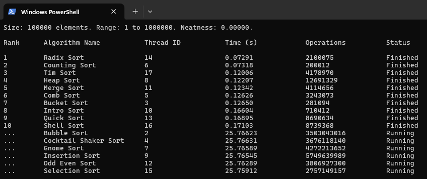

# Sorting Algorithm Race
A terminal-based sorting algorithm race visualizer, which puts 16 different sorting algorithms head to head to showcase how different array ranges and sizes effect the performance of various types of sorting algorithms.

## About
This project puts 16 different sorting algorithms in a race. Each algorithm has one thread to run on, as the main thread prints the information to the terminal. The program keep tracks of general statistics as well as the number of operations - those being mainly comparisons and writes to arrays.

There are 5 total statuses a sorting algorithm can be in: "Ready", "Running", "Checking", and then either "Finished" or "Failed". Since the "Checking" state is just seeing if everything is sorted, the status quickly changes to "Finished", making it hard to notice it is there. However, with a high enough element count, you will notice it for a brief second.

The program waits for the user to press Enter, than sorts the vector `dataset`. What is cool, is that each algorithm makes a copy of the same data via passing it into the array for each function, which is to ensure fairness among our competitors. I thought it was important that each algorithm sorts the same exact array, even if the elements are randomly generated. Once the algorithm is finished, it is passed to the function `verify`, and if that function returns `true` the status is set to "Finished", or "Failed" if `verify` returns `false`.

The program also shows each thread's ID, the time in seconds, and of course upon completion, the rank of the sorting algorithm. It is worth noting the time taken is likely not accurate for each sorting algorithm, if we are only talking about the raw speed to sort the data. In the code for the sorting algorithm it increases `sort.operations` for the sort's respective class, which takes some time.

Below is a table with some basic information on each sorting algorithm, per ChatGPT:

| Algorithm | Average Time | Best Time | Worst Time | Space | Type |
|-----------|--------------|-----------|------------|-------|------|
| Bubble Sort | $O(n^2)$ | $O(n)$ | $O(n^2)$ | $O(1)$ | Exchange |
| Bucket Sort | $O(n + k)$ | $O(n + k)$ | $O(n^2)$ | $O(n + k)$ | Distribution (Non-comparison) |
| Cocktail Shaker Sort | $O(n^2)$ | $O(n)$ | $O(n^2)$ | $O(1)$ | Exchange |
| Comb Sort | $O(n^2)$ | $O(n \log n)$ | $O(n^2)$ | $O(1)$ | Exchange |
| Counting Sort | $O(n + k)$ | $O(n + k)$ | $O(n + k)$ | $O(n + k)$ | Distribution (Non-comparison) |
| Gnome Sort | $O(n^2)$ | $O(n)$ | $O(n^2)$ | $O(1)$ | Exchange |
| Heap Sort | $O(n \log n)$ | $O(n \log n)$ | $O(n \log n)$ | $O(1)$ | Selection (Heap-based) |
| Insertion Sort | $O(n^2)$ | $O(n)$ | $O(n^2)$ | $O(1)$ | Insertion |
| Introsort | $O(n \log n)$ | $O(n \log n)$ | $O(n \log n)$ | $O(\log n)$ | Hybrid (Quick + Heap + Insertion) |
| Merge Sort | $O(n \log n)$ | $O(n \log n)$ | $O(n \log n)$ | $O(n)$ | Merge (Divide & Conquer) |
| Odd-Even Sort | $O(n^2)$ | $O(n)$ | $O(n^2)$ | $O(1)$ | Exchange |
| Quicksort | $O(n \log n)$ | $O(n \log n)$ | $O(n^2)$ | $O(\log n)$ | Partition Exchange (Divide & Conquer) |
| Radix Sort | $O(d(n + k))$ | $O(d(n + k))$ | $O(d(n + k))$ | $O(n + k)$ | Distribution (Non-comparison) |
| Selection Sort | $O(n^2)$ | $O(n^2)$ | $O(n^2)$ | $O(1)$ | Selection |
| Shell Sort | $O(n^{3/2})$ | $O(n \log n)$ | $O(n^2)$ | $O(1)$ | Insertion (Gap-based) |
| Tim Sort | $O(n \log n)$ | $O(n)$ | $O(n \log n)$ | $O(n)$ | Hybrid (Merge + Insertion) |

## Inspiration
I orignally was motivated to make this from a video that popped up in my recommended in YouTube. I thought it was interesting how many sorting algorithms existed I had no idea about, and the fact that they actually all had a unique process to sort data was fascinating.

<a href="https://www.youtube.com/watch?v=vr5dCRHAgb0">
  
</a>

[sorting algorithms to relax/study to](https://www.youtube.com/watch?v=vr5dCRHAgb0)

However, I thought it was lacking the ability to race. And it randomizes the array differently for each sorting algorithm in this video, meaning you couldn't just compare the sort time it tells you in the top left corner.

I also wanted to see how different sorts handle different ranges and amounts of data. Would one sort always be on top if I ranked them by time, no matter the array that is passed to the sorting algorithm? Or would they be different? A clear example of this is how Counting sort thrives when the range of integers is small, and there is a high amount of elements.

Later on, I uncovered more resources similar to this: [Toptal Sorting Algorithms](https://www.toptal.com/developers/sorting-algorithms) and [Sound of Sorting](https://github.com/bingmann/sound-of-sorting).

## Observations
Through running my program, a few things stood out to me:
- Intro sort, which has a lot of logic in deciding which sort to use, placed lower on very small datasets since more simpler ones got straight to the point and avoided more complex optimizations.
- Non-caomparitve sorts such as Radix Sort, Bucket Sort, and Counting Sort remained dominant over large datasets, which makes sense due to their linear time.
- With very small datasets, like 256 for example. the top 5 is almost random. This is because at this number of elements, the randomness more greatly effects how each algorithm sorts. You need a larger dataset for the sorting algorithms to differentiate themselves from each other, sort of like the law of large numbers.

## Dependencies
- C++
- CMake

## Build and Compile
`cmake -S . -B build`  
`cmake --build build`

## Usage
Upon running the program, you must press Enter to start. To change the minimum value, maximum value, and the number of elements in the array being sorted, configure [dataset.hpp](include/dataset.hpp) and change the constants at the top - `MIN`, `MAX`, and `ELEMENTS`.
- Adjust terminal and font size properly.
- Times will likely vary between different hardware.
- For less efficient sorts, like Bubble sort for example, be careful with going to high, or else it runs for what feels like forever. The bottom 6 all had this problem with larger and larger amounts of elements.
- But, you can also take a algorithm away by commenting out some in [list.cpp](src/list.cpp).
    - I prefer this set up since it takes away the noticably slower sorts:
```c++
std::vector<std::reference_wrapper<Algorithm>> algorithms = {
    // bubbleSort,
    bucketSort,
    // cocktailShakerSort,
    combSort,
    countingSort,
    // gnomeSort,
    heapSort,
    // insertionSort,
    introSort,
    mergeSort,
    // oddEvenSort,
    quickSort,
    radixSort,
    // selectionSort,
    shellSort,
    timSort
};
```

Note: The entire project is not designed for vectors with floats, or other data types. It is currently only adapted for integers.

## How Some of the Algorithms Work
I don't want to have to write about all 16 of them, but a couple stood out to me that felt important, and I wanted to point them out here.

### [Counting Sort](src/sorts/counting.cpp)
I feel like this one was the definition of work smarter not harder. It is basically bottlenecked by your memory since it works by mapping the values to indices in a new array. It is also used in the Radix sort also in the project.

### [Radix Sort](src/sorts/radix.cpp)
This algorithm sorts data by first going right to left for each digit and putting elements into 10 buckets. Leaning about this brought up phone numbers. I realized why phone numbers were a common example for Radix sort - because phone numbers have area codes at the highest or left most digits.

### [Tim Sort](src/sorts/tim.cpp)
This one is cool since it is one of the algorithms in my project that combines multiple different algorithms together. These being Insertion sort and Merge sort. I thought it was worth highlighting because it is used in Python, Java, and JavaScript, to name a few.

## Adding Your Own Sorting Algorithm
- Make two new files: one in `include/sorts` (`mysort.hpp`) and the other in `src/sorts` (`mysort.cpp`)
- `mysort.hpp` should have:
```c++
#pragma once

#include "dataset.hpp"
#include <vector>

void mySort(std::vector<int> arr);
```
- and `mysort.cpp` should have:
```c++
#include "list.hpp"
#include <vector>
#include "sorts.hpp"
#include "sorts/verify.hpp"

void mySort(std::vector<int> arr) {
    mySort.id = std::this_thread::get_id();
    mySort.startTime = std::chrono::steady_clock::now();
    mySort.status = "Running";

    // Sorting logic here

    mySort.status = "Checking";
    mySort.status = verify(arr) ? "Finished" : "Failed";
}
```
- You can also add this line of code inside of the algorithm to keep track of operations done:
```c++
mySort.operations++;
```
- Add to [list.hpp](include/list.hpp):
```c++
extern Algorithm mySort;
```
- And [list.cpp](src/list.cpp):
```c++
Algorithm mySort(-1, "My Sort", std::this_thread::get_id(), "Ready", mySort);

std::vector<std::reference_wrapper<Algorithm>> algorithms = {
    ...,
    mySort
};
```
- Then, add it to [sorts.hpp](include/sorts.hpp), which brings all of the sorts to one file for organization purposes:
```c++
#include "sorts/mysort.hpp"
```
- Lastly, add the excecutable to [CMakeLists.txt](CMakeLists.txt):
```CMake
add_executable(Sorting-Algorithm-Race
    ...
    src/sorts/mysort.cpp
)
```

## Future Additions
All in all, I wanted to include a wide array of different types of sorts, which I believe I did. If I even do come back to this project, I would make some sorting algorithms multithreaded, so the thread ID column would be more interesting and so the sorts could reach their full potential. After all, some sorts I implememented really only shine when ran in parallel. I would also add sorts like Bitonic Sort, Tree Sort, Pigeonhole Sort, and subsets of Radix Sort. I'd probably also change the operations to be a less broad value, since, the way I incrememnt operations is admittatly a little inconsistant. A small change I could add, so users don't have to comment out slower sorts, is a time out feature. If a sort takes a long enough time, it's status goes to "Timed Out" instead of "Failed" or "Finished" as one of the end conditions. One last future addition worth implementing was making a neatly sorted option for when we randomize the data we are sorting, since many sorts perform differently when the data is already somewhat sorted. At least for now, I am happy with what is there currently.

## Screenshots

