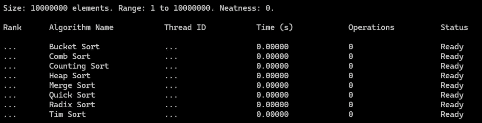
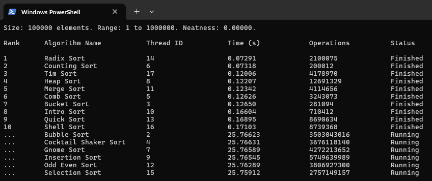
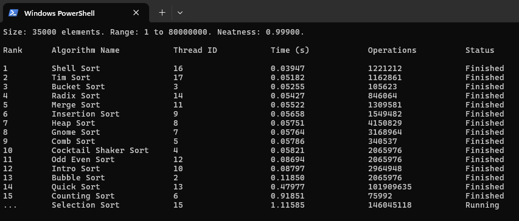

# Sorting Algorithm Race
A terminal-based sorting algorithm race visualizer, which puts any sorting algorithm head to head to showcase how different data being sorted effects the performance of various sorting algorithms.

<br>

[](...)
[](...)
[](...)

<br>

## Dependencies
- C++17
- CMake 3.20+

## Installation
Clone the repository and navigate into the project directory: 
```bash  
git clone https://github.com/zbob256/Sorting-Algorithm-Race.git  
cd Sorting-Algorithm-Race
```

## Build and Compile
Configure the project with CMake:  
```bash
cmake -S . -B build  
cmake --build build
```

## Run
After building, run the executable from the `build` directory:  
```bash
./build/Sorting-Algorithm-Race
```

<br>

## Overview
This project puts as many as 16 different sorting algorithms in a race. Each sorting algorithm obtains one thread to run on, as the main thread prints information to the terminal. The program keep tracks of general statistics as well as the number of operations - those being mainly comparisons and writes to arrays. It is worth mentioning the operations section is currently inconsistent across every algorithm, but I eventually want to change how we increment operations.

There are 5 total statuses a sorting algorithm can be in: "Ready", "Running", "Checking", and then either "Finished" or "Failed".

The program waits for the user to press Enter, than sorts the vector `dataset`. Each algorithm makes a copy of the same data by passing it into the array for each function to ensure fairness among each algorithm. Once one's status is "Finished", the vector is passed to the function `verify`, and if that function returns `true` the status is set to "Finished", or if `verify` returns `false`, "Failed".

The program also shows each thread's ID, the time in seconds, and of course the rank of the sorting algorithm upon completion. It is worth noting the time taken is likely not accurate for each sorting algorithm, if we are only talking about the raw speed to sort the array. In the code for the sorting algorithm it increases `sort.operations` for the sort's respective class, which takes some time.

### Currently, here is every sorting algorithm in the project:
1. Bubble Sort
2. Bucket Sort
3. Cocktail Shaker Sort
4. Comb Sort
5. Counting Sort
6. Gnome Sort
7. Heap Sort
8. Insertion Sort
9. Intro Sort
10. Merge Sort
11. Odd-Even Sort
12. Quick Sort
13. Radix Sort
14. Selection Sort
15. Shell Sort
16. Tim Sort

## Inspiration
I orignally was motivated to make this from a video on YouTube called [sorting algorithms to relax/study to](https://www.youtube.com/watch?v=vr5dCRHAgb0). I thought the sheer number of completely unique ways to sort a list of numbers was fascinating.

<a href="https://www.youtube.com/watch?v=vr5dCRHAgb0">
  
</a>

However, the project the video is based on, [Array V](https://github.com/Gaming32/ArrayV), and similar projects like [Sound of Sorting](https://github.com/bingmann/sound-of-sorting), lacked the ability to race lots of sorting algorithms together. I also wanted to race bigger numbers than their visualizers allowed for, as well as capture a closer raw speed of the algorithms, when they aren't bottlenecked by having to move bars around on a window.

## Usage
Upon running the program, you must press Enter to start. To change the minimum value, maximum value, the number of elements in the array being sorted, and the neatness of the array (how sorted it already is), configure [dataset.hpp](include/dataset.hpp) and change the constants at the top - `MIN`, `MAX`, `ELEMENTS`, and `NEATNESS`.
- Adjust terminal and font size properly.
- For less efficient sorts, like Bubble sort for example, be careful with going to high, or else it runs for what feels like forever. The bottom 6 all had this problem with larger amounts of elements.
- That being said, you can also take algorithms away by commenting out some in [list.cpp](src/list.cpp).
    - I prefer this set up since it takes away the noticably slower sorts (bottom 6):
```c++
std::vector<std::reference_wrapper<Algorithm>> algorithms = {
    // bubbleSort,
    bucketSort,
    // cocktailShakerSort,
    combSort,
    countingSort,
    // gnomeSort,
    heapSort,
    // insertionSort,
    introSort,
    mergeSort,
    // oddEvenSort,
    quickSort,
    radixSort,
    // selectionSort,
    shellSort,
    timSort
};
```

*Note: the entire project was not designed for vectors with floats, or other data types. It is currently only adapted for integers.*

## Adding Your Own Sorting Algorithm
- Make two new files: in `include/sorts`: (`mysort.hpp`) and in `src/sorts`: (`mysort.cpp`).
- `mysort.hpp` should contain:
```c++
#pragma once

#include "dataset.hpp"
#include <vector>

void myFunc(std::vector<int> arr);
```
- and `mysort.cpp` should have:
```c++
#include "list.hpp"
#include <vector>
#include "sorts.hpp"
#include "sorts/verify.hpp"

void myFunc(std::vector<int> arr) {
    mySort.id = std::this_thread::get_id();
    mySort.startTime = std::chrono::steady_clock::now();
    mySort.status = "Running";

    // Sorting logic here

    mySort.status = "Checking";
    mySort.status = verify(arr) ? "Finished" : "Failed";
}
```
- You can also add this line of code inside of the algorithm to keep track of operations done:
```c++
mySort.operations++;
```
- Add to [list.hpp](include/list.hpp):
```c++
extern Algorithm mySort;
```
- And [list.cpp](src/list.cpp):
```c++
Algorithm mySort(-1, "My Sort", std::this_thread::get_id(), "Ready", myFunc);

std::vector<std::reference_wrapper<Algorithm>> algorithms = {
    ...,
    mySort
};
```
- Then, add it to [sorts.hpp](include/sorts.hpp), which brings all of the sorts to one file for organization purposes:
```c++
#include "sorts/mysort.hpp"
```
- Lastly, add the excecutable to [CMakeLists.txt](CMakeLists.txt):
```CMake
add_executable(Sorting-Algorithm-Race
    ...
    src/sorts/mysort.cpp
)
```

## Screenshots

<div style="display: flex; flex-wrap: wrap; gap: 10px;">
    
    
</div>
